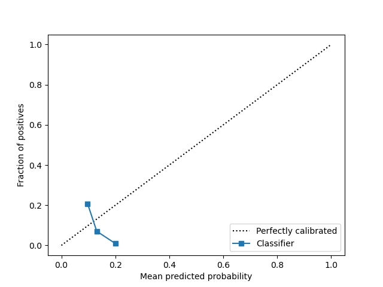

# SUMMARY
Note, I manually unpacked the data into .csv files but figured it wasn't good to push that since
it was in the gitignore.

## Column Removal

|Column Name|Reason|
|---|---|
|pub_rec_bankruptcies|\*\_rec\_\*|
|acc_now_delinq|current delinquencies assumed to be after 1st payment|
|pub_rec|\*\_rec\_\*|
|sec_app_chargeoff_within_12_mths|\*\_chargeoff\_\*|
|chargeoff_within_12_mths|\*\_chargeoff\_\*|
|out_prncp|exist after 1st payment|
|sec_app_collections_12_mths_ex_med|\*\_collections\_\*|
|tot_cur_bal|assumed to exist after 1st payment|
|avg_cur_bal|assumed to exist after 1st payment|
|tot_coll_amt|assumed to exist after 1st payment|
|mths_since_last_record|unsure what "rec" stood for in \*\_rec\_\*; possibly "record" (assumed "recent" was OK and refers to at the time of origination)|
|last_fico_range_low|assumed "last" to be after 1st payment|
|last_fico_range_high|assumed "last" to be after 1st payment|
|last_credit_pull_d|assumed "last" to be after 1st payment|

Additionally dropped any columns where all of the values were empty.

## Columns Kept
Kept columns like number of open accounts, inquiries, open credit lines, number of past due accounts,
FICO scores, etc. as they would realistically affect the likelihood of default. This information
would be known before any payments are made. Additionally, columns for a possible secondary
applicant (that are similar to the primary applicant columns) are kept since a second borrower
could affect the likelihood of default.

## Scores
```
With No Calibration
  Accuracy Score:  0.9300168702781558
  ROC-AUC Score:  0.6533310517055836
  Brier Score:  0.06750041641721034
With Isotonic Calibration
  Accuracy Score:  0.9300168702781558
  ROC-AUC Score:  0.6496556110200972
  Calibration (Reliability Curve):
    Fraction of Positivies:  [0.01717461 0.07620339 0.19731318]
    Mean Predicted Probability:  [0.08491444 0.13554273 0.20812284]
  Brier Score:  0.06740611002230251
With Sigmoid Calibration
  Accuracy Score:  0.9300168702781558
  ROC-AUC Score:  0.3509196418352241
  Calibration (Reliability Curve):
    Fraction of Positivies:  [0.20737913 0.07022866 0.00927972]
    Mean Predicted Probability:  [0.09724894 0.131159   0.20017815]
  Brier Score:  0.07047242550987018
```

Isotonic calibration is much better than sigmoid. With isotonic, the classifier is very close to
the true values. With sigmoid, it is very far off. Plots can be seen below.

### Isotonic Calibration Curve


### Sigmoid Calibration Curve
