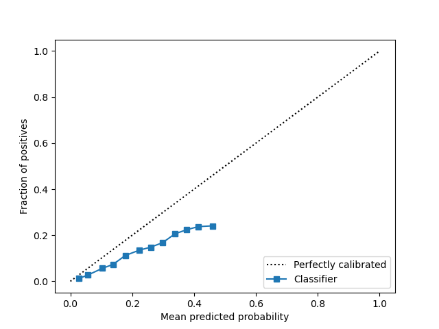

# SUMMARY
Note, I manually unpacked the data into .csv files but figured it wasn't good to push that since
it was in the gitignore.

## Column Removal

|Column Name|Reason|
|---|---|
|pub_rec_bankruptcies|\*\_rec\_\*|
|acc_now_delinq|current delinquencies assumed to be after 1st payment|
|pub_rec|\*\_rec\_\*|
|sec_app_chargeoff_within_12_mths|\*\_chargeoff\_\*|
|chargeoff_within_12_mths|\*\_chargeoff\_\*|
|out_prncp|exist after 1st payment|
|sec_app_collections_12_mths_ex_med|\*\_collections\_\*|
|tot_cur_bal|assumed to exist after 1st payment|
|avg_cur_bal|assumed to exist after 1st payment|
|tot_coll_amt|assumed to exist after 1st payment|
|mths_since_last_record|unsure what "rec" stood for in \*\_rec\_\*; possibly "record" (assumed "recent" was OK and refers to at the time of origination)|
|last_fico_range_low|assumed "last" to be after 1st payment|
|last_fico_range_high|assumed "last" to be after 1st payment|
|last_credit_pull_d|assumed "last" to be after 1st payment|

Additionally dropped any columns where all of the values were empty.

## Columns Kept
Kept columns like number of open accounts, inquiries, open credit lines, number of past due accounts,
FICO scores, etc. as they would realistically affect the likelihood of default. This information
would be known before any payments are made. Additionally, columns for a possible secondary
applicant (that are similar to the primary applicant columns) are kept since a second borrower
could affect the likelihood of default.

## Scores
```
Accuracy Score:  0.9300168702781558
ROC-AUC Score:  0.6533310517055836
Calibration (Reliability Curve):
  Fraction of Positives:  [0.01232933 0.02752976 0.05644097 0.07310659 0.11202073 0.13487476
0.14811463 0.16760195 0.20599842 0.22371968 0.23741007 0.24074074]
  Mean Predicted Probability:  [0.02800896 0.05719684 0.10369756 0.13782812 0.17767043 0.22241131
0.25938824 0.2981821  0.33807039 0.37550751 0.41366586 0.45904178]
Brier Score:  0.06750041641721034
```

### Calibration Curve


## Decision Policy
I found all of the loans with the smallest PD value, sorted them by the funded amount (funded_amnt) in ascending order, and selected the first k number of loans where the sum of the funded amount was less than or equal to the budget ($50,000). In this case, I selected 35 loans, all of which had funded amounts ranging from $1000 to $2000 (this can be seen in the table below). I maximized the number of loans that could be invested in.

Since the number of loans for the minimum PD value was so high, all of the selected loans have the same PD value. I do account for the possibility of this code running on a dataset where this is not the case. In order to test for this, the code on lines 182-185 can be uncommented. Additionally, since none of the loans that my rule selected defaulted, uncommenting this code will also result in selected loans where one does default.

## Backtest

### Assumptions
I assumed that a defaulted loan would have either a value of 'Charge Off' or 'Late (31-120 days)' for loan_status. A non-defaulted loan would have values of 'Fully Paid', 'Current', 'In Grace Period', 'Late (16-30 days)'. (Both the budget and the values for default vs. not default are stored in constants at the top of the file for ease-of-modification.)

### Selected default rate vs. overall default rate
```
Default rate(s) for selected loans: [0.01691053]
Minimum default rate: 0.016910529536703012
Maximum default rate: 0.4626723154292341
Average default rate: 0.12735088808167314
```

### Loans Selected to Invest In
|        id | loan_status   |   funded_amnt |   prob_default |   collected_payments |   ROI_proxy |
|----------:|:--------------|--------------:|---------------:|---------------------:|------------:|
| 111865260 | Current       |          1000 |      0.0169105 |              1084.32 |   0.08432   |
| 116812161 | Current       |          1000 |      0.0169105 |              1084.32 |   0.08432   |
| 118637707 | Fully Paid    |          1000 |      0.0169105 |              1084.32 |   0.08432   |
| 116813247 | Current       |          1000 |      0.0169105 |              1084.32 |   0.08432   |
| 118306411 | Current       |          1000 |      0.0169105 |              1084.32 |   0.08432   |
| 118331114 | Current       |          1000 |      0.0169105 |              1084.32 |   0.08432   |
| 116819814 | Current       |          1000 |      0.0169105 |              1084.32 |   0.08432   |
| 117232000 | Current       |          1000 |      0.0169105 |              1084.32 |   0.08432   |
| 116876029 | Fully Paid    |          1000 |      0.0169105 |              1084.32 |   0.08432   |
| 113540982 | Current       |          1000 |      0.0169105 |              1084.32 |   0.08432   |
| 117886073 | Current       |          1000 |      0.0169105 |              1084.32 |   0.08432   |
| 114189349 | Fully Paid    |          1200 |      0.0169105 |              1301.04 |   0.0842    |
| 116268941 | Fully Paid    |          1300 |      0.0169105 |              1409.4  |   0.0841538 |
| 113100552 | Current       |          1400 |      0.0169105 |              1518.12 |   0.0843714 |
| 113097805 | Current       |          1475 |      0.0169105 |              1599.12 |   0.0841492 |
| 115354395 | Current       |          1500 |      0.0169105 |              1626.48 |   0.08432   |
| 114781013 | Current       |          1500 |      0.0169105 |              1626.48 |   0.08432   |
| 117468497 | Current       |          1500 |      0.0169105 |              1626.48 |   0.08432   |
| 118606867 | Current       |          1500 |      0.0169105 |              1626.48 |   0.08432   |
| 115055510 | Fully Paid    |          1500 |      0.0169105 |              1626.48 |   0.08432   |
| 116256097 | Current       |          1500 |      0.0169105 |              1626.48 |   0.08432   |
| 115375996 | Current       |          1500 |      0.0169105 |              1626.48 |   0.08432   |
| 116823418 | Current       |          1550 |      0.0169105 |              1680.48 |   0.0841806 |
| 115707596 | Current       |          1600 |      0.0169105 |              1734.84 |   0.084275  |
| 117839549 | Fully Paid    |          1600 |      0.0169105 |              1734.84 |   0.084275  |
| 113524856 | Fully Paid    |          1600 |      0.0169105 |              1734.84 |   0.084275  |
| 113490739 | Fully Paid    |          1600 |      0.0169105 |              1734.84 |   0.084275  |
| 116255386 | Fully Paid    |          1700 |      0.0169105 |              1843.2  |   0.0842353 |
| 115047496 | Fully Paid    |          1800 |      0.0169105 |              1951.56 |   0.0842    |
| 112770635 | Fully Paid    |          1800 |      0.0169105 |              1951.56 |   0.0842    |
| 115372293 | Current       |          1800 |      0.0169105 |              1951.56 |   0.0842    |
| 118263546 | Fully Paid    |          1800 |      0.0169105 |              1951.56 |   0.0842    |
| 115393308 | Current       |          2000 |      0.0169105 |              2168.28 |   0.08414   |
| 117892493 | Current       |          2000 |      0.0169105 |              2168.28 |   0.08414   |
| 112915338 | Fully Paid    |          2000 |      0.0169105 |              2168.28 |   0.08414   |

## Explainability
Using the permutation_importance() function and roc_auc for scoring, it shows that the 'sub_grade', 'home_ownership', 'verification_status', and 'term' features are the top features. All of the other features have identical importance mean values. I am unsure as to what 'sub_grade' or 'verification_status' represent (as they are not included in the data dictionary), but 'home_ownership' is not that suprising. Owning a home, as opposed to renting or having a current mortgage, could indicate that they've fully paid off a mortgage in the past, therefore making them more likely to pay off the current loan. I am a bit surprised that the length of repayment is more important than the other features. Intuitively, I don't know whether people with shorter or longer terms are more or less likely to finish paying off their loan. It is also surprising that some of the other features are not more important, but it is possible that they are too highy correlated.

The actual code that calculates the importance takes a really long time to run, so I copied the result into a constant for reference. If you would like to run it yourself, uncomment lines 248-250.